# WARNING: This repository is no longer maintained

> This repository will not be updated. The repository will be kept available in read-only mode.

# Monitor IBM Cloud Pak With Watson OpenScale

In this Code Pattern, we will use German Credit data to train, create, and deploy a machine learning model using [Watson Machine Learning](https://www.ibm.com/cloud/machine-learning/) on [Cloud Pak for Data (CP4D)](https://www.ibm.com/analytics/cloud-pak-for-data). We will create a data mart for this model with [Watson OpenScale](https://www.ibm.com/cloud/watson-openscale/) and configure OpenScale to monitor that deployment, then inject seven days' worth of historical records and measurements for viewing in the OpenScale Insights dashboard.

When the reader has completed this Code Pattern, they will understand how to:

* Create and deploy a machine learning model using the Watson Machine Learning service on IBM Cloud Pak for Data (ICP4D)
* Setup Watson OpenScale Data Mart
* Bind Watson Machine Learning to the Watson OpenScale Data Mart
* Add subscriptions to the Data Mart
* Enable payload logging and performance monitor for subscribed assets
* Enable Quality (Accuracy) monitor
* Enable Fairness monitor
* Score the German credit model using the Watson Machine Learning service
* Insert historic payloads, fairness metrics, and quality metrics into the Data Mart
* Use Data Mart to access tables data via subscription


## Flow

1. Create a new project on ICP4D.
1. The developer creates a Jupyter Notebook within this project.
1. OpenScale on ICP4D is connected to a DB2 database, which is used to store Watson OpenScale data.
1. The notebook is connected to Watson Machine Learning and a model is trained and deployed.
1. Watson OpenScale is used by the notebook to log payload and monitor performance, quality, and fairness.
1. OpenScale will monitor the Watson Machine Learning model for performance, fairness, quality, and explainiblity.

## Prerequisites

* [IBM Cloud Pak for Data](https://www.ibm.com/analytics/cloud-pak-for-data)
* [Watson OpenScale Add-on installed for ICP4D](https://www.ibm.com/support/producthub/icpdata/docs/content/SSQNUZ_current/svc-welcome/aiopenscale.html)
* [Watson OpenScale configured for ICP4D](https://cloud.ibm.com/docs/services/ai-openscale-icp?topic=ai-openscale-icp-gs-get-started)
* [Watson Machine Learning Add On for Cloud Pak for Data](https://www.ibm.com/support/producthub/icpdata/docs/content/SSQNUZ_current/wsj/analyze-data/ml-install-overview.html)
* [Create an IBM Cloud instance of DB2 Warehouse](https://developer.ibm.com/tutorials/virtualizing-db2-warehouse-data-with-data-virtualization/#step-4-set-up-the-db2-warehouse-on-ibm-cloud)


# Steps

1. [Clone the repository](#1-clone-the-repository)
1. [Create a new project and deployment space](#2-create-a-new-project-and-deployment-space)
1. [Configure OpenScale in a Jupyter Notebook](#3-configure-openscale-in-a-jupyter-notebook)
1. [Utilize the dashboard for OpenScale](#4-utilize-the-dashboard-for-openscale)

## 1. Clone the repository

In a terminal window, execute the following commands:

```bash
git clone https://github.com/IBM/monitor-ibm-cloud-pak-with-watson-openscale
cd monitor-ibm-cloud-pak-with-watson-openscale
```

## 2. Create a new project and deployment space

### Create a new project

In Cloud Pak for Data, we use the concept of a project to collect / organize the resources used to achieve a particular goal (resources to build a solution to a problem). Your project resources can include data, collaborators, and analytic assets like notebooks and models, etc.

* Launch a browser and navigate to your Cloud Pak for Data deployment.

* Go the (☰) menu and click *Projects*:


* Click on *New project*. In the dialog that pops up, select the project type as `Analytics project` and click `Next`:


* Click on the top tile for `Create an empty project`:


* Give the project a unique name, an optional description and click `Create`:


### Create a Deployment Space

Cloud Pak for Data uses the concept of `Deployment Spaces` to configure and manage the deployment of a set of related deployable assets. These assets can be data files, machine learning models, etc.

* Go the (☰) menu and click `Analyze` -> `Analytics deployments`:


* Click on `New deployment space +`:


* Click on the top tile for 'Create an empty space':


* Give your deployment space a unique name, an optional description, then click `Create`.

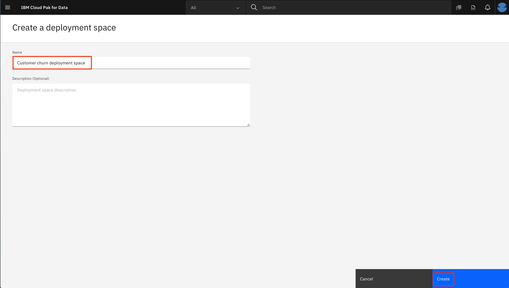

You will use this space later when you deploy a machine learning model.

### Add collaborator

Next, we will add a collaborator to the new deployment space, so that assets we deploy can be monitored in step 4.

* Click on your new deployment space.


* Click on the `Access control` tab and then click on `Add collaborators +` on the right.


* Enter "admin" as a Collaborator and select the user from the drop down list. Then click on the `Add to list +` button. Then click the `Add` button to finish adding the collaborator.

> **NOTE:** We are adding the user that configured the machine learning instance for OpenScale monitoring. In this case, the user is the admin user. If the user is someone other than "admin", then that user should be added as a collaborator here.


You should be brought back to the deployment space page and see your user ID along with the `admin` user as collaborators for this space.

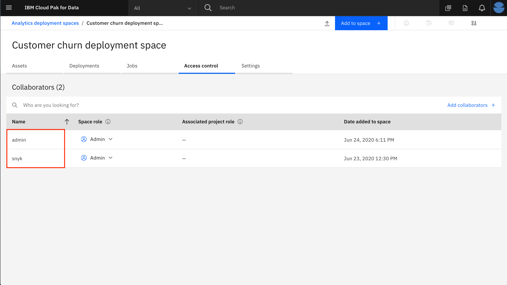

## 3. Configure OpenScale in a Jupyter Notebook

For this part of the pattern we're going to configure our Watson OpenScale service by running a Jupyter Notebook.

### Import the notebook

At the project overview click the `Add to project +` button, and choose `Notebook` or click the `New notebook +` option next to the `Notebooks` section.


On the next panel select the `From URL` tab, give your notebook a name, provide the following URL, and choose the Python 3.6 environment:

Provide the notebook URL [https://raw.githubusercontent.com/IBM/monitor-ibm-cloud-pak-with-watson-openscale/master/notebooks/ConfigureOpenScale.ipynb](https://raw.githubusercontent.com/IBM/monitor-ibm-cloud-pak-with-watson-openscale/master/notebooks/ConfigureOpenScale.ipynb).

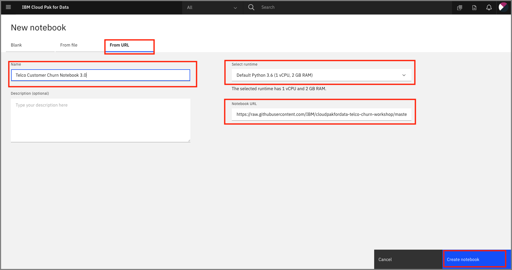 and click `Create notebook`.

When the Jupyter notebook is loaded and the kernel is ready then we can start executing cells.


### Update credentials

* In the notebook section 1.2 you will add your ICP platform credentials for the `WOS_CREDENTIALS`.
* For the `url` field, change `https://w.x.y.z` to use the IP address of your ICP cluster, i.e., something like: "url": "https://zen-cpd-zen.omid-cp4d-v5-2bef1f4b4097001da9502000c44fc2b2-0001.us-south.containers.appdomain.cloud"
* For the `username`, use your login username.
* For the `password`, use your login password.
* For the `DATABASE_CREDENTIALS` and `SCHEMA_NAME` values, follow instructions from prerequisites to *Create an IBM Cloud instance of DB2 Warehouse*
* For the `CUSTOM_NAME`, provide a custom value that will be concatenated to "_MODEL", "_DEPLOYMENT" and "_MONITOR" to generate the names for your model, deployment and open scale monitor.

### Run the notebook

Important: Make sure that you stop the kernel of your notebook(s) when you are done, in order to prevent leaking of memory resources!

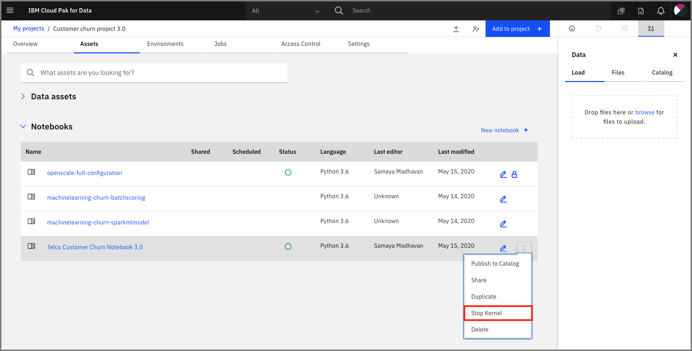

Spend a minute looking through the sections of the notebook to get an overview. You will run cells individually by highlighting each cell, then either click the `Run` button at the top of the notebook or hitting the keyboard short cut to run the cell (Shift + Enter but can vary based on platform). While the cell is running, an asterisk (`[*]`) will show up to the left of the cell. When that cell has finished executing a sequential number will show up (for example, `[17]`).

### Get transactions for Explainability

Under `8.9 Identify transactions for Explainability` run the cell. It will produce a series of UIDs for individual ML scoring transactions. Copy one or more of them to examine in the next section.

## 4. Utilize the dashboard for Openscale

Now that you have created a machine learning model and configured Openscale, you can utilize the OpenScale dashboard to gather insights.

### Use the insights dashboard

The *Insights Dashboard* provides an overview of the models that OpenScale is monitoring.

* Open the `Services` tab by clicking the icon in the upper right. Go to the `OpenScale` tile under the `AI` category and click `Open`:

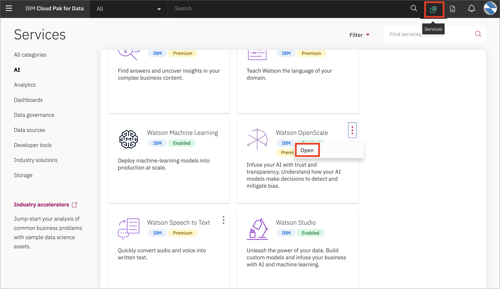

* When the dashboard loads, Click on the `Model Monitors`  tab and you will see the one deployment you configured in the previous section.


Do not worry if the name you see does not match exactly with the screenshot. The deployment name you see will correspond to the variable used in the Jupyter notebook

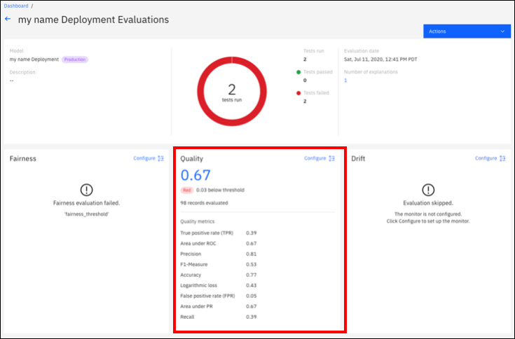

The quality monitor scans the requests sent to your model deployment \(i.e., the payload\) to let you know how well your model predicts outcomes. Quality metrics are calculated hourly, when OpenScale sends manually labeled feedback to the deployed model.


* We now have an alert on the Quality of the model.
* _**Click**_ on the deployment tile to open the details page.  You will see the triangle with `!` under `Quality` -> `Area under ROC`. This indicates that there has been an alert for the `Quality` monitor. Alerts are configurable, based on thresholds for quality outcomes which can be set and altered as desired.
* We have set a threshold of 70% and based on the feedback data loaded in the notebook, the model is performing below that threshold.

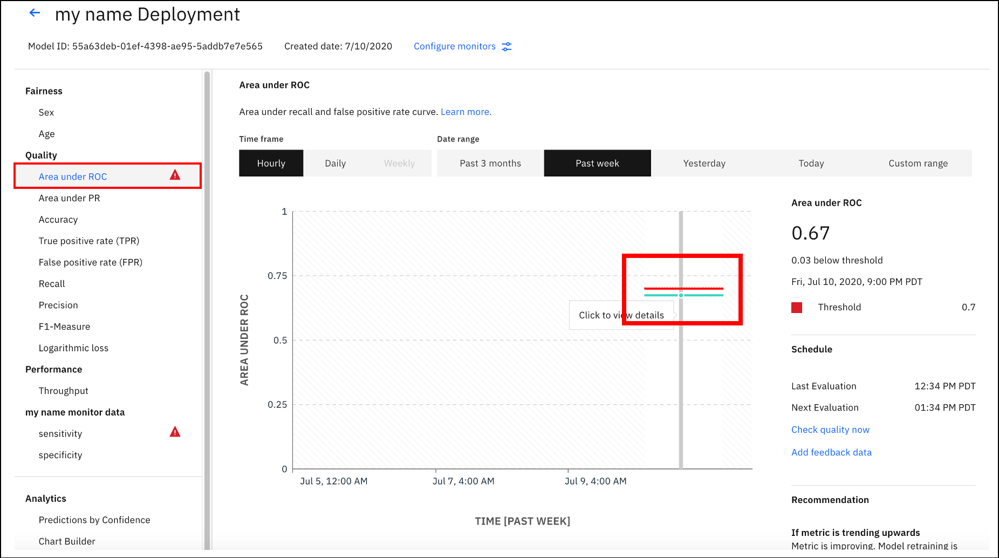

* Feel free to explore the other quality metrics for the model. **Click** on the green line \(which represents the quality run we initiated from the Jupyter Notebook\), to view more details for a particular point on the performance graph.

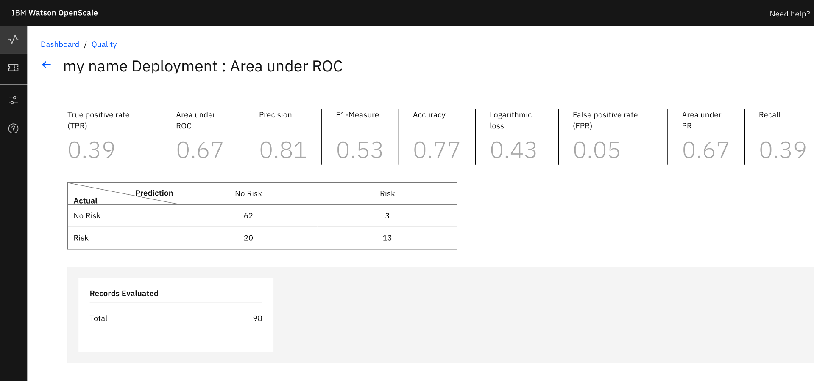


* Now, go back to the *Insights Dashboard* page by clicking on the left-hand menu icon for `Insights`, make sure that you are on the `Model monitors` tab, and click the 3-dot menu on the tile and then `Configure monitors`:

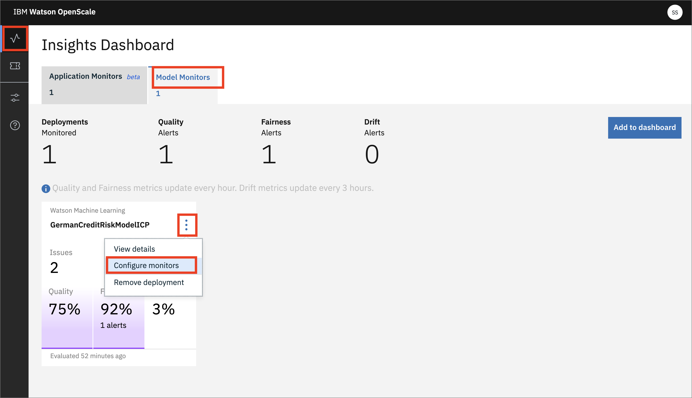

* Click the `Endpoints` menu. Select the `Endpoints` tab on the far right-hand side. Select `Debiased transactions` from the dropdown where you see `Payload logging`. This is the REST endpoint that offers a debiased version of the credit risk ML model, based on the features that were configured (i.e., Sex and Age). It will present an inference, or score, that attempts to remove the bias that has been detected.
* You will see code examples on how to use the Fairness Debiased endpoint below the `Debiased transactions` drop-down menu. You can see code snippets using cURL, Java, and Python, which can be used in your scripts or applications to access this debiased endpoint:


* Similarly, on the same  `Endpoints` tab, you can choose the `Feedback logging` drop-down to get code for Feedback Logging. This provides an endpoint for sending fresh test data for ongoing quality evaluation. You can upload feedback data here or work with your developer to integrate the code snippet provided to publish feedback data to your Watson OpenScale database.

### Examine an individual transaction

* Click on the left-hand menu icon for `Explain a transaction` and click one of the transactions that have been run. These are the transactions that have been cached. Alternately, enter the transaction UID you copied after running  the notebook from [step 3.](#3-configure-openscale-in-a-jupyter-notebook)

> NOTE: Each time you create the Explainibility data, the perterbation algorithm is sending 1000's of requests to the deployed Machine Learning REST endpoint, so the first time this is done can take a few seconds.


* From the info icon next to `Details`:

*Explanations show the most significant factors when determining an outcome. Classification models also include advanced explanations. Advanced explanations are not available for regression, image, and unstructured text models.*

* Click on the info icon next to `Minimum changes for another outcome` and look at the feature values:

*Pertinent Negative<br/>
Pertinent Negatives (PN) are feature values obtained by changing the value of each feature away from its median such that the model prediction changes. If the feature attributes were set to these values, the prediction would change. This is the minimum set of changes in feature values to generate a different prediction.*

* Click on the info icon next to `Maximum changes allowed for the same outcome` and look at the feature values:

*Pertinent Positive<br/>
Pertinent Postives (PP) are feature values obtained by changing the values of each feature towards its median such that the model prediction remains the same. The prediction does not change, even if the feature attributes are set to these values. This is the maximum possible change while maintaining the existing prediction. Each feature value changes so that it moves towards its median value in the training data.*

You can see under `Most important factors influencing prediction` the Feature, Value, and Weight of the most important factors for this score.

A full breakdown of the factors contributing to either "Risk" or "No Risk" are at the bottom.

### Using the Analytics tools

* From the model monitor view, click on `Analytics` -> `Chart Builder`. Here you can create charts using various Measurements, Features, and Dimensions of your machine learning model. Change them and examine the charts that are created:

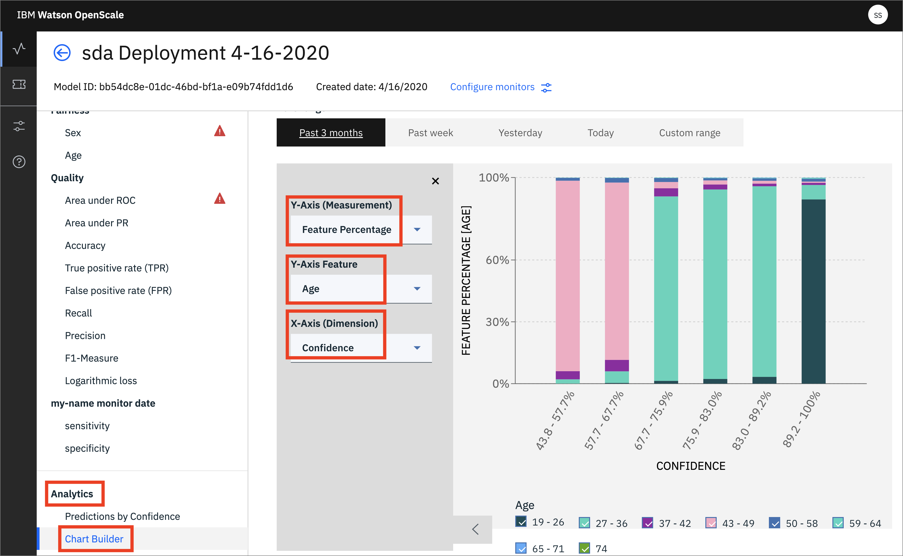

* You can also see a chart that breaks down *Predictions by Confidence*:

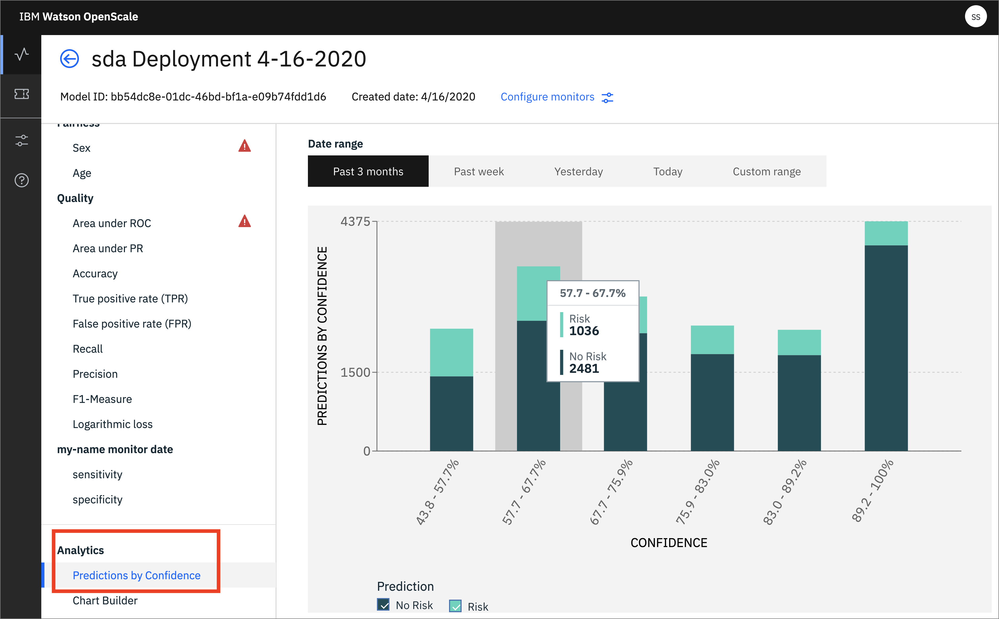


> NOTE: Returning to the Cloud Pak for Data requires altering the URL in the browser, so that the cluster name is the only thing present. Remove anything in the browser URL containing `/aiopenscale/*`.

# License
[Apache 2.0](LICENSE)
