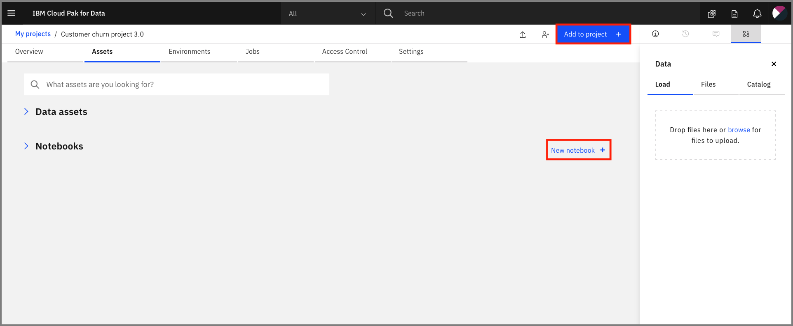

# Monitor IBM Cloud Pak With Watson OpenScale

In this Code Pattern, we will use German Credit data to train, create, and deploy a machine learning model using [Watson Machine Learning](https://www.ibm.com/cloud/machine-learning/) on [Cloud Pak for Data (CP4D)](https://www.ibm.com/analytics/cloud-pak-for-data). We will create a data mart for this model with [Watson OpenScale](https://www.ibm.com/cloud/watson-openscale/) and configure OpenScale to monitor that deployment, then inject seven days' worth of historical records and measurements for viewing in the OpenScale Insights dashboard.

When the reader has completed this Code Pattern, they will understand how to:

* Create and deploy a machine learning model using the Watson Machine Learning service on IBM Cloud Pak for Data (ICP4D).
* Setup Watson OpenScale Data Mart
* Bind Watson Machine Learning to the Watson OpenScale Data Mart
* Add subscriptions to the Data Mart
* Enable payload logging and performance monitor for subscribed assets
* Enable Quality (Accuracy) monitor
* Enable Fairness monitor
* Score the German credit model using the Watson Machine Learning
* Insert historic payloads, fairness metrics, and quality metrics into the Data Mart
* Use Data Mart to access tables data via subscription


## Flow

1. Create a new project on ICP4D
1. The developer creates a Jupyter Notebook within this project.
1. OpenScale on ICP4D is connected to a DB2 database, which is used to store Watson OpenScale data.
1. The notebook is connected to Watson Machine Learning and a model is trained and deployed.
1. Watson OpenScale is used by the notebook to log payload and monitor performance, quality, and fairness.
1. OpenScale will monitor the Watson Machine Learning model for performance, fairness, quality, and explainiblity.

## Prerequisites

* [IBM Cloud Pak for Data](https://www.ibm.com/analytics/cloud-pak-for-data)
* [Watson OpenScale Add-on installed for ICP4D](https://www.ibm.com/support/producthub/icpdata/docs/content/SSQNUZ_current/cpd/svc/openscale/openscale-overview.html)
* [Watson OpenScale configured for ICP4D](https://cloud.ibm.com/docs/services/ai-openscale-icp?topic=ai-openscale-icp-gs-get-started)
* [Watson Machine Learning Add On for Cloud Pak for Data](https://www.ibm.com/support/producthub/icpdata/docs/content/SSQNUZ_current/wsj/analyze-data/ml-install-overview.html)
* [Create an IBM Cloud instance of DB2 Warehouse](https://developer.ibm.com/tutorials/virtualizing-db2-warehouse-data-with-data-virtualization/)


# Steps

1. [Clone the repository](#1-clone-the-repository)
1. [Create a new project and deployment space](#2-create-a-new-project-and-deployment-space)
1. [Configure OpenScale in a Jupyter Notebook](#3-configure-openscale-in-a-jupyter-notebook)
1. [Utilize the dashboard for OpenScale](#4-utilize-the-dashboard-for-openscale)

## 1. Clone the repository

In a terminal window, execute the following commands:

```bash
git clone https://github.com/IBM/monitor-ibm-cloud-pak-with-watson-openscale
cd monitor-ibm-cloud-pak-with-watson-openscale
```

## 2. Create a new project and deployment space
### Create a New project

In Cloud Pak for Data, we use the concept of a project to collect / organize the resources used to achieve a particular goal (resources to build a solution to a problem). Your project resources can include data, collaborators, and analytic assets like notebooks and models, etc.

* Go the (☰) menu and click *Projects*


* Click on *New project*


* We are going to create an empty, as opposed to creating a  project from an existing file. Select the _*Create an empty project*_ option:


* Give the project a name and click `Create`:


### Create a Deployment Space

Cloud Pak for Data uses the concept of `Deployment Spaces` to configure and manage the deployment of a set of related deployable assets. These assets can be data files, machine learning models, etc.

* Go the (☰) menu and click `Analyze` -> `Analytics deployments`:


* Click on `+ New deployment space`:


* Give your deployment space a unique name, optional description, then click `Create`. You will use this space later when you deploy a machine learning model.

* Next, we will add a collaborator to the new deployment space, so that assets we deploy can be monitored in step 4.

* Click on your new deployment space.


* Click on the `Access control` tab and then click on `Add collaborators` on the right.


* Enter "admin" as a Collaborator and select the user from the drop down list. Then click on the `Add to list` button.

> **NOTE:** We are adding the user that configured the machine learning instance for OpenScale monitoring. In this case, the user is the admin user.


* Click the `Add` button to finish adding the collaborator. You should be brought back to the deployment space page and see your user ID along with the `Admin` user as collaborators for this space.


## 3. Configure OpenScale in a Jupyter Notebook

For this part of the pattern we're going to configure our Watson OpenScale service by running a Jupyter Notebook.

### Import the notebook

At the project overview, either click the *New Asset* button [1], and choose *Add notebook* or go to the *Notebooks* tab [2] and choose *+ Add notebook* [3].



On the next panel select the *From URL* tab [1] and give your notebook a name [2].

Provide the notebook URL [https://raw.githubusercontent.com/IBM/monitor-ibm-cloud-pak-with-watson-openscale/master/notebooks/ConfigureOpenScale.ipynb](https://raw.githubusercontent.com/IBM/monitor-ibm-cloud-pak-with-watson-openscale/master/notebooks/ConfigureOpenScale.ipynb) [3].

Choose a Python 3.x environment [4], then click *Create* [5].


When the Jupyter notebook is loaded and the kernel is ready then we can start executing cells.


### Update credentials

* In the notebook section 1.2 you will add your ICP platform credentials.
* For the `url` field, change `https://w.x.y.z:31843` to use the IP address of your ICP cluster. Make sure you have the port appended `31843`.
* For the `username`, use your login username.
* For the `password`, user your login password.

### Run the notebook

Spend an minute looking through the sections of the notebook to get an overview. You will run cells individually by highlighting each cell, then either click the `Run` button at the top of the notebook. While the cell is running, an asterisk (`[*]`) will show up to the left of the cell. When that cell has finished executing a sequential number will show up (i.e. `[17]`).

### Get transactions for Explainability

Under `8.9 Identify transactions for Explainability` run the cell. It will produce a series of UIDs for indidvidual ML scoring transactions. Copy one or more of them to examine in the next section.

## 4. Utilize the dashboard for Openscale

Now that you have created a machine learning model and configured Openscale, you can utilize the OpenScale dashboard to gather insights.

### Use the insights dashboard

Click on the left-hand menu icon for `Insights`, then choose the tile for your configured model (or the 3-dot menu on the tile and then `View Details`:


You can see the top monitor highlighted, for the feature `Sex`.

By moving your mouse pointer over the graph, you can see the values change, and which contains bias. Click one spot to veiw the details. Later, we'll click `Configure Monitors` to get a Fairness endpoint:


Once you open the details page, you can see more information:


Click on `View Transactions` to drill deeper:


Now, go back to the top-level page when you click the Monitor Deployment tile and click `Configure Monitors`. Click the `Fairness` menu, then the `Debias Endpoint` tab:


Then scroll down for code examples on how to use the Fairness Debiased endpoint:


Similarly, you can choose the `Quality` menu and choose the `Feedback` tab to get code for Feedback Logging.

### Examine an individual transaction

Click on the left-hand menu icon for `Explain a transaction` and enter the transaction UID you copied previously into the search bar.


From the info icon next to `Details`:
"Explanations show the most significant factors when determining an outcome. Classification models also include advanced explanations. Advanced explanations are not available for regression, image, and unstructured text models."

Click on the info icon next to `Minimum changes for No Risk outcome` and look at the feature values:
"Pertinent Negative
If the feature values were set to these values, the prediction would change. This is the minimum set of changes in feature values to generate a different prediction. Each feature value is changed so that it moves towards its median value in the training data."

Click on the info icon next to `Maximum changes allowed for the same outcome` and look at the feature values:
"Pertinent Positive
The prediction will not change even if the feature values are set to these values. This is the maximum change allowed while maintaining the existing prediction. Each feature value is changed so that it moves towards its median value in the training data."

You can see under `Most important factors influencing prediction` the Feature, Value, and Weight of the most important factors for this score.

A full breakdown of the factors contributing to either "Risk" or "No Risk" are at the bottom.

# License
[Apache 2.0](LICENSE)
